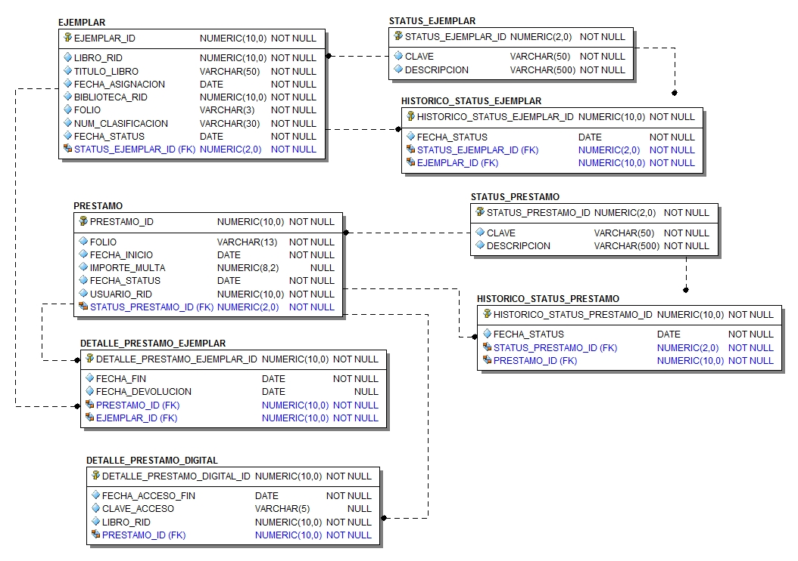

# SchoolBook
## schoolbook-ejemplares.
* Este servicio se encarga de realizar la administración de los ejemplares que son asignados a las bibliotecas.
* Los préstamos de ejemplares que realizan los estudiantes también son administrados por este servicio.
* Tanto los ejemplares como los préstamos definen un ciclo de vida. Para realizar el control se ha implementado una serie de status acompañados de su histórico.
* La definición del caso de estudio completo se puede revisar en este [enlace](https://github.com/school-book/schoolbook-app)
### Entidades principales
* Ejemplar
* Histórico de status del ejemplar
* Préstamo
* Histórico de status del préstamo
* Detalle de los ejemplares incluidos en cada préstamo.
### Modelo relacional

